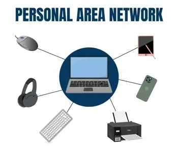
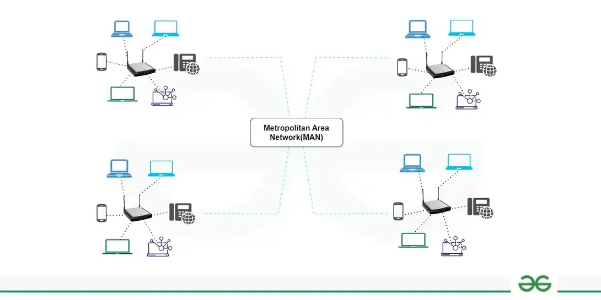
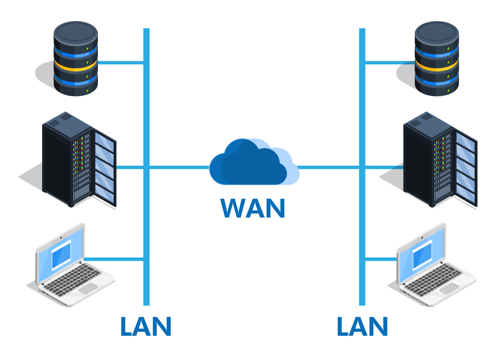

#Network/Sessão-1/Redes

[PAN - Personal Area Network](#PAN%20-%20Personal%20Area%20Network)
[LAN - Local Area Network](#LAN%20-%20Local%20Area%20Network)
[MAN - Metropolitan Area Network](#MAN%20-%20Metropolitan%20Area%20Network)
[WAN - Wide Area Network](#WAN%20-%20Wide%20Area%20Network)

---
## PAN - Personal Area Network

### Examples of PAN:
 - ***Body Area Network:***   
    It is a mobile network that moves with a persona range for example when a person connects his smartphone to the Bluetooth headphone and moves in the market that refers to a body area network.
- ***Offline Network:***   
    In this multiple devices are connected through Bluetooth or Wi-Fi. The devices attached to your computer including printers, mouse, speakers, and other appliances are integrated using a Personal Area Network (PAN) and do not use the internet. So a communication network is formed between the devices used in a small single space for example home.   
     
- ***Home Office:***   
    In Home Office set up a separate smaller network is set up for work purposes which is separate from the network used by other home appliances. This network works as a separate body with multiple other devices connected for office work purposes.

  
### Advantages of PAN
- PAN is relatively flexible and provides high efficiency for short network ranges.
- It needs easy setup and relatively low cost.
- It does not require frequent installations and maintenance
- It is easy and portable.
- Needs fewer technical skills to use.

### Disadvantages of PAN
- Low network coverage area/range.
- Limited to relatively low data rates.
- Devices are not compatible with each other.
- Inbuilt WPAN devices are a little bit costly.

---

## LAN - Local Area Network

## Types of LAN

There are different architectures in LAN as discussed below:

- ***Client/Server LANs:*** Multiple devices (the clients) are connected to a main server in a client/server LAN. The server controls network traffic, device access, application access, and file storage. Any connected device that runs apps or accesses the Internet qualifies as a client. Clients can use wired or wireless connections to connect to the server.
- ***Peer-to-Peer LANs:*** Peer-to-peer LANs are commonly smaller because they shortage a central server and can't support huge workloads like client/server LANs can. Every device on a peer-to-peer LAN collaborates equally to the network's operation. Through wired or wireless connections to a switch or router, the devices share data and resources. Peer-to-peer networks are the norm in homes.
- ***Ethernet:*** It is most widely used architecture. ethernet specifies the network speed, cable type and network interface adapters. This type of architecture used in both wired or wireless networks.
- ***Token ring:*** Token ring is a type of local area network (LAN) setup that was once widely used but is now less common. It manages network access through the use of tokens and has an operating speed of 100 megabits per second.
- ***Cloud-managed:*** A cloud-managed LAN depend on a centralized cloud service to handle tasks such as access control, policy enforcement, network setup, and various security and performance issues. This approach simplifies management in diverse network environments, making it ideal for businesses.

## Differences Between Wired LAN, Wireless LAN and Virtual LAN

### Wired LAN

A wired LAN connects devices like, servers, IoT devices, and other electronic devices to a company network using switches and Ethernet cables. For small organization, or businesses with a limited number of devices, a wired LAN might just consist of a single, unmanaged switch with Ethernet ports to connect all the devices.

### Wireless LAN

A wireless LAN allows devices to connect to the network without physical cables. Wireless LAN or WLANs transfer data over radio waves using wireless technology. This type of LAN is commonly found in homes, offices, coffee shops, and restaurants where mobility is important. WLANs enable devices such as computers, smartphones, and tablets to connect to the internet or other shared resources. For example connecting mobile to the hotspot is a wireless LAN.

Wireless LANs use the IEEE 802.11 standards to transmit data between devices and the network through the wireless system. In many cases, WLANs are preferred over wired LANs due to their flexibility and cost efficiency, as they eliminate the need for extensive cabling. Businesses considering WLANs as their main form of connectivity often have users who primarily depend on mobile devices like smartphones and tablets.

### Virtual LAN

In larger LANs that connect thousands of devices, more hardware, software, and configuration are needed to maintain optimal network performance. This is where virtual LANs (VLANs) become useful.

---

## MAN - Metropolitan Area Network

### Characteristics of MAN

- It covers an area from 5 km to 50 km which can cover a city.
- MAN is owned by a group of users rather than a single company.
- MAN provides high speed network which uses shared regional resources.
- Size of MAN is in between WAN and LAN.
- In MAN, data rates are moderate to high.
- MAN networks provides high reliability because the error rate in this network is very less.
- A MAN network can use a variety of access technologies, such as wireless, fiber-optic, or copper-based connections, to provide connectivity to different devices and networks.

### Advantages of MAN

- MAN covers a larger area than LAN.
- It has less implementation cost and it uses less resources.
- It provides higher security than WAN.
- It can cover area as large as a city.
- MAN is a faster way to connect two fast LANs together.
- In some installation of MANs, users can share their internet connection. So multiple users can get the same high-speed internet.

### Disadvantages of MAN

- MAN is not easily manageable as it becomes very complex.
- It requires highly skilled people to look after it.
- It requires more cables for connecting the LAN's.
- It has high management cost
- It covers smaller area than WAN.
- It is only used in metropolitan areas.

### Examples of MAN

- Digital cable television
- Used in government agencies
- Used to connect several branches of the local school
- A network of fire stations
- University campuses
- Networking between community colleges within the country
- Cable broadband

---

## WAN - Wide Area Network

### Advantages of WAN

- ***Large area coverage:*** WAN covers a large geographical area(1000 km or more than). Ex. If your business office is situated in another country and you live in another country then WAN is a platform to communicate with each other(i.e. you and your office staff members).             
- ***Higher bandwidth:*** WAN networks usually cover large geographical areas. Ex.1000 km or more than the wide area network has higher bandwidth than LAN and MAN networks.
- ***Centralized data:*** Using the WAN network you can share the data connected to all the devices in the respective network. Ex. By using the WAN network, all branches are capable to share all data through the head office server and you can get support, full backup, and other precious data from the head office, and all data gets synchronized along with all other company branches.
- ***Message Exchange:*** With the help of the Internet Of Things (IoT) and LAN, a sudden growth of WAN-based devices can be seen. This communication via message can be done fastest with the help of the most popular apps like messenger and WhatsApp.

### Disadvantages of WAN

- ***Security issue:*** WAN faces more security problems than LAN and MAN networks due to WAN networks more technologies are merged. It can open a security gap, which paves the way of occurring malicious attacks and identity intruders.
- ***Installation cost:*** WANs are default complex and complicated because of large geographical area coverage. Hence there is a set-up cost in expensive WAN that also needs routers, switches, and other security solutions.
- ***Troubleshooting issues:*** Troubleshoot the big challenge on the WAN network and it requires more time. If any issue occurs in the computer network then it is the most difficult part to find out the proper cause due to their broad coverage area. 
- ***Maintenance issues:*** In a WAN network, it is difficult to maintain the network especially a data center that operates 24/7 is the biggest challenge out of all. Here 24/7 needs assistance from network administrators and technicians. In a WAN, maintenance cost is high.

---
