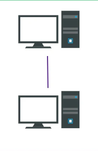
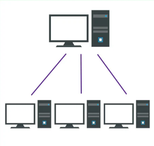
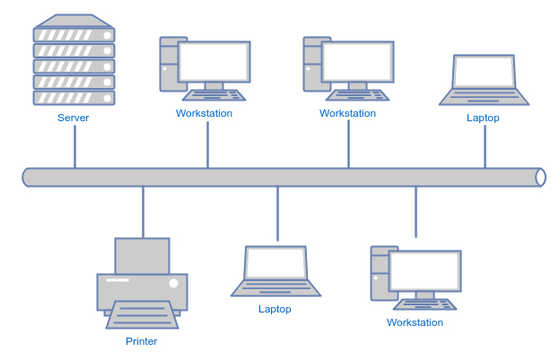
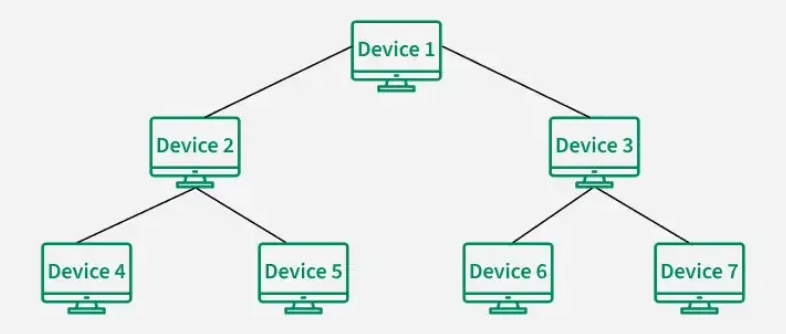
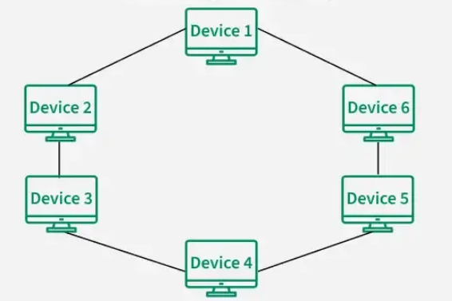
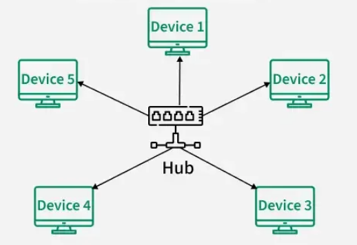
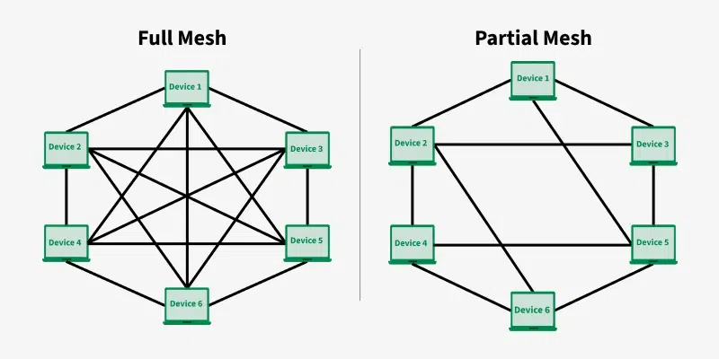

#Network/Sessão-1/Topologias-Redes
[Point-to-Point](#Point-to-Point)
[Point-to-MultiPoint](#Point-to-MultiPoint)
[Barramento (BUS)](#Barramento%20(BUS))
[Árvore (TREE)](#Árvore%20(TREE))
[Anel (RING)](#Anel%20(RING))
[Estrela (STAR)](#Estrela%20(STAR))
	[[]]
[Malha (MESH)](#Malha%20(MESH))
	[Mesh Total](#Mesh%20Total)
	[Mesh Parcial](#Mesh%20Parcial)
[Hibrida / Combinada](#Hibrida%20/%20Combinada)
## Point-to-Point

## Point-to-MultiPoint

| S.NO | Point to point communication                                                                                                                              | Multipoint Communication                                                                                                  |
| ---- | --------------------------------------------------------------------------------------------------------------------------------------------------------- | ------------------------------------------------------------------------------------------------------------------------- |
| 1.   | Point to point communication means the channel is shared between two devices.                                                                             | Multipoint Communication means the channel is shared among multiple devices or nodes.                                     |
| 2.   | In this communication, There is dedicated link between two nodes.                                                                                         | In this communication, link is provided at all times for sharing the connection among nodes.                              |
| 3.   | In this communication, the entire capacity is reserved between these connected two devices with the possibility of waste of network bandwidth/ resources. | In this communication, the entire capacity isn't reserved by any two nodes and the network bandwidth is maximum utilized. |
| 4.   | In this communication, there is one transmitter and one receiver.                                                                                         | In this communication, there is one transmitter and many receivers.                                                       |
| 5.   | In point-to-point connections, the smallest distance is most important to reach the receiver.                                                             | In Multi-point connections, the smallest distance is not important to reach the receiver.                                 |
| 6.   | Point-to-point communication provides security and privacy because communication channel is not shared.                                                   | Multi-point communication does not provide security and privacy because communication channel is shared.                  |

---
## Barramento (BUS)

### Best Practice for Designing Bus Topology

1. ***Plan for Scalability:*** Plan for the network's future growth and expansion. Ensure that the bus topology can accommodate extra devices with out extensively affecting overall performance.
2. ***Use Good Quality Cabling:*** Create a good cabling setup for the bus backbone. Ensure that the cable is properly shielded to minimize sign interference and degradation. Use cable with suitable bandwidth and make certain that it meets the necessities of the network.
3. ***Implement Redundancy:*** Think about adding redundancy to decrease the risk of a single point of failure (SPoF).
4. ***Terminate the Bus Properly:*** Terminate both ends of the bus with terminators to prevent signal reflection and ensure signal integrity. Improper termination can result in signal degradation and performance issues.

### Advantages of Bus Topology

- It is the easiest network topology for linearly connecting peripherals or computers.
- It works very efficiently well when there is a small network.
- The length of cable required is less than a star topology.
- It is easy to connect or remove devices in this network without affecting any other device.
- Very cost-effective as compared to other network topology i.e. mesh and star
- It is easy to understand topology.
- Easy to expand by joining the two cables together.

### Disadvantages of Bus Topology

- Bus topology is not good for large networks.
- Identification of problems becomes difficult if the whole network goes down.
- Troubleshooting individual device issues is very hard.
- Need terminators are required at both ends of the main cable.
- Additional devices slow the network down.
- If the main cable is damaged, the whole network fails or splits into two.
- Packet loss is high.
- This network topology is very slow as compared to other topologies.

---
## Árvore (TREE)

### Advantages of Tree Topology

- It allows more devices to be attached to a single central hub thus it decreases the distance that is traveled by the signal to come to the devices.
- It allows the network to get isolated and also prioritize from different computers.
- We can add ***new devices to the existing network.***
- ***Error detection*** and ***error correction*** are very easy in a tree topology.

### Disadvantages of Tree Topology

- If the central hub gets fails the entire system fails.
- The cost is high because of the cabling.
- If new devices are added, it becomes difficult to reconfigure.

---
## Anel (RING)

The most common access method of ring topology is token passing.

- ***Token passing:*** It is a network access method in which a token is passed from one node to another node.
- ***Token:*** It is a frame that circulates around the network.

### Operations of Ring Topology

- One station is known as a monitor station which takes all the responsibility for performing the operations.
- To transmit the data, the station has to hold the token. After the transmission is done, the token is to be released for other stations to use.
- When no station is transmitting the data, then the token will circulate in the ring.
- There are two types of token release techniques: ***Early token release*** releases the token just after transmitting the data and ***Delayed token release*** releases the token after the acknowledgment is received from the receiver.

### Advantages of Ring Topology

- The data transmission is high-speed.
- The possibility of collision is minimum in this type of topology.
- Cheap to install and expand.
- It is less costly than a star topology.

### Disadvantages of Ring Topology

- The failure of a single node in the network can cause the entire network to fail.
- Troubleshooting is difficult in this topology.
- The addition of stations in between or the removal of stations can disturb the whole topology.
- Less secure.

---
## Estrela (STAR)

### Types of Star Topology

There are two types of star topology:

- Active Star Topology
- Passive Star topology

***Active Star Topology***: In active star topology, the central hub regenerates the signal when it passes through it. This simply means that the hub not only works as a connector but also boosts the signal and makes sure the signals reach their destination properly.

***Passive Star Topology:*** In passive star topology, the central hub simply connects the devices, but does not regenerate the signals. Here, the devices connected are responsible for the transmission of signals. Passive star topology is recommended for smaller setups.

### What are the best practices of Star Topology?

Below mentioned are some of the applications of Star Topology:

- ***Home Networks:*** Star Topology is used in a home network where all devices connects to a connected to a central router that manages the Internet.
- ***ATM Networks:*** In banks, ATMs are also connected in as a star network, as it helps in managing data efficiently.
- ***Hospital Networks:*** Hospital devices, medicinal equipment are connected in the star topology. It helps in easily accessing data records.
- ***CCTV Networks:*** Star Topology are also used in CCTV Networks where multiple cameras are connected to central video recorder.

### What is the Importance of Star Topology in LAN?

Star Topology is important in Local Area Network because it helps in easy management and scalability of the network. As central hub is present in the star topology, it becomes simple to monitor and control network traffic among devices present in the network. Because of star topology, adding or removing devices becomes easy and it also helps in expanding networks.

### Advantages of Star Topology

- It is very reliable as if one cable or device fails then all the others will still work.
- It is high performing as no data collisions can occur.
- It is less expensive because each device only needs one I/O port and wishes to be connected to the hub with one link.
- Easy fault detection because the links are often easily identified.
- No disruptions to the network when connecting or removing devices.
- Each device requires just one port i.e. to attach to the hub.
- If N devices are connected to each other in star, then the amount of cables required to attach them is N. So, it's easy to line up.

### Disadvantages of Star Topology

- Requires more cable than bus topology.
- If the connecting network device (network switch) fails, the nodes attached are disabled and can't participate in network communication.
- More expensive than linear bus topology due to the value of the connecting devices (network switches).
- If the hub goes down everything goes down, none of the devices can work without the hub.
- Hub requires more resources and regular maintenance because it's the central system of Star.
- Extra hardware is required (hubs or switches) which adds to the cost.
- Performance is predicated on the one concentrator i.e. hub.

### Difference Between Star and Bus Topology

|Star Topology|Bus Topology|
|---|---|
|All devices are connected to a central hub|All devices are connected to a single central cable (called the bus)|
|If a device fails, only that device is affected, the rest of the network keeps working|If a device fails, the rest of the network keeps working|
|Requires more cable as compared to Bus Topology|Requires less cables as compared to Star Topology|
|Motly used for small to medium size networks|Mostly used for simple networks having fewer devices|

---
## Malha (MESH)

### Mesh Total
- All the nodes within the network are connected with every other If there are n number of nodes during a network, each node will have an n-1 number of connections. A full mesh provides an excellent deal of redundancy, but because it is expensive to implement, it's usually reserved for network backbones.

### Mesh Parcial
- The partial mesh is more practical as compared to the full mesh. In a partially connected mesh, all the nodes aren't necessary to be connected with one another during a network. Peripheral networks are connected using partial mesh topology.

### Applications of Mesh Topology

Below mentioned are some of the applications of Mesh Topology:

- ***Wireless Networks:*** Many homes and small office spaces uses Mesh WIFI System for better internet coverage and connectivity.
- ***Industrial and Manufacturing Networks:*** Many industries uses mesh topology to control machinery, ensuring better productivity.
- ***Smart Homes:*** Some advanced homes also use mesh topology for connecting home appliances like smart lights, security systems, etc.
- ***Military Communication:*** Mesh Topology are used in Military Purposes as if one connection fails, then there is always a chance of another connection.

### Advantages of Mesh Topology

- In case of failure of a single device, the entire network didn't break.
- There is no traffic problem as there is a dedicated point to point links for every device.
- Mesh Topology provides high privacy and security.
- Data transmission is more consistent because failure doesn’t disrupt its processes.
- Adding new devices won’t disrupt transmission of data.

### Disadvantages of Mesh Topology

- Mesh Topology is costly as compared to the other network topologies i.e. star, bus, point to point topology.
- Installation of nodes are difficult in mesh topology.
- Power requirement is higher as all the nodes will need to remain active all the time and share the load.
- Each node requires a extra utility cost.
- More maintenance is required in mesh topology.

---
## Hibrida / Combinada

### Star-Ring Hybrid Topology

### Star-Bus Hybrid Topology

### Hierarchical Network Topology

### Advantages of Hybrid Topology

Below are the advantages of hybrid topology:

- Adding a new node or deleting the existing node is easy in hybrid topologies.
- Hybrid topology is more secure, reliable, and scalable as compared to individual star, ring and mesh topology.
- Error detection and troubleshooting is easier in hybrid topology.
- When an organization has a large geographical area utilizing hybrid topology is considered as better option.
- Traffic with large volume is handled easily by the hybrid topology.
- The overall performance and speed is greater in hybrid topology.

### Disadvantages of Hybrid Topology

Below are the disadvantages of hybrid topology:

- The design and implementation of hybrid network topology is difficult.
- More number of cables and other physical devices are required for hybrid topology.
- The process of installation of hybrid topology is difficult.
- The overall implementation, setup and process of hybrid topology is much more costlier.