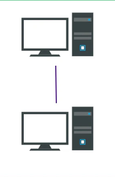

#Network/Sessão-1/Topologias-Redes
[Point-to-Point](#Point-to-Point)
[Point-to-MultiPoint](#Point-to-MultiPoint)
[Barramento (BUS)](#Barramento%20(BUS))
[Árvore (TREE)](#Árvore%20(TREE))
[Anel (RING)](#Anel%20(RING))
[Estrela (STAR)](#Estrela%20(STAR))
[Malha (MESH)](#Malha%20(MESH))
	[Mesh Parcial](#Mesh%20Parcial)
	[Mesh Total](#Mesh%20Total)
[Hibrida / Combinada](#Hibrida%20/%20Combinada)
## Point-to-Point

---
## Point-to-MultiPoint

---
## Barramento (BUS)

- Todos os nodes estão interligados pelo cabo de backbone
- Só uma comunicação em simultâneo. Se falhar os outros não são afetados
- Pouca escalabilidade, sendo apenas adequada a pequenas redes
- Pouca segurança e performance, e difícil de fazer troubleshooting

---
## Árvore (TREE)

---
## Anel (RING)

---
## Estrela (STAR)

---
## Malha (MESH)

### Mesh Parcial

### Mesh Total

---
## Hibrida / Combinada

