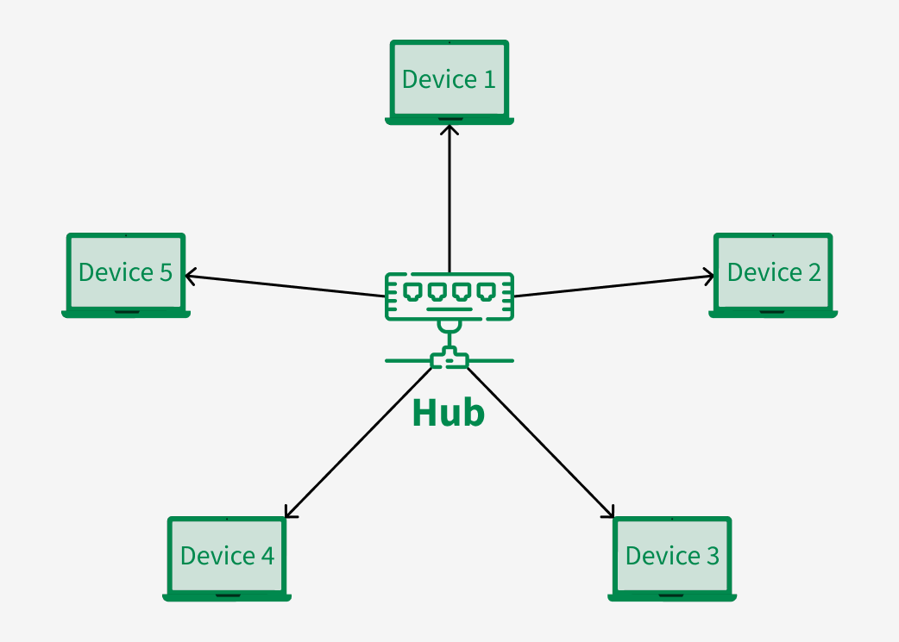

#Network/Sessão-1/Topologias-Redes
[Point-to-Point](#Point-to-Point)
[Point-to-MultiPoint](#Point-to-MultiPoint)
[Barramento (BUS)](#Barramento%20(BUS))
[Árvore (TREE)](#Árvore%20(TREE))
[Anel (RING)](#Anel%20(RING))
[Estrela (STAR)](#Estrela%20(STAR))
[Malha (MESH)](#Malha%20(MESH))
	[[]
	[Mesh Total](#Mesh%20Total)
[Hibrida / Combinada](#Hibrida%20/%20Combinada)
## Point-to-Point

---
## Point-to-MultiPoint

---
## Barramento (BUS)

- Todos os nodes estão interligados pelo cabo de backbone
- Só uma comunicação em simultâneo. Se falhar os outros não são afetados
- Pouca escalabilidade, sendo apenas adequada a pequenas redes
- Pouca segurança e performance, e difícil de fazer troubleshooting

---
## Árvore (TREE)

---
## Anel (RING)

---
## Estrela (STAR)

---
## Malha (MESH)

### Mesh Total
- All the nodes within the network are connected with every other If there are n number of nodes during a network, each node will have an n-1 number of connections. A full mesh provides an excellent deal of redundancy, but because it is expensive to implement, it's usually reserved for network backbones.

### Mesh Parcial
- The partial mesh is more practical as compared to the full mesh. In a partially connected mesh, all the nodes aren't necessary to be connected with one another during a network. Peripheral networks are connected using partial mesh topology.

---
## Hibrida / Combinada

