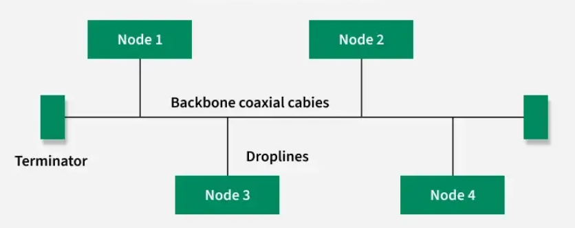

#Network/Sessão-1/Topologias-Redes
[Point-to-Point](#Point-to-Point)
[Point-to-MultiPoint](#Point-to-MultiPoint)
[Barramento (BUS)](#Barramento%20(BUS))
[Árvore (TREE)](#Árvore%20(TREE))
[Anel (RING)](#Anel%20(RING))
[Estrela (STAR)](#Estrela%20(STAR))
[Malha (MESH)](#Malha%20(MESH))
	[Mesh Total](#Mesh%20Total)
	[Mesh Parcial](#Mesh%20Parcial)
[Hibrida / Combinada](#Hibrida%20/%20Combinada)
## Point-to-Point

---
## Point-to-MultiPoint

---
## Barramento (BUS)

- Todos os nodes estão interligados pelo cabo de backbone
- Só uma comunicação em simultâneo. Se falhar os outros não são afetados
- Pouca escalabilidade, sendo apenas adequada a pequenas redes
- Pouca segurança e performance, e difícil de fazer troubleshooting

---
## Árvore (TREE)

---
## Anel (RING)

The most common access method of ring topology is token passing.

- ***Token passing:*** It is a network access method in which a token is passed from one node to another node.
- ***Token:*** It is a frame that circulates around the network.

### Operations of Ring Topology

- One station is known as a monitor station which takes all the responsibility for performing the operations.
- To transmit the data, the station has to hold the token. After the transmission is done, the token is to be released for other stations to use.
- When no station is transmitting the data, then the token will circulate in the ring.
- There are two types of token release techniques: ***Early token release*** releases the token just after transmitting the data and ***Delayed token release*** releases the token after the acknowledgment is received from the receiver.

### Advantages of Ring Topology

- The data transmission is high-speed.
- The possibility of collision is minimum in this type of topology.
- Cheap to install and expand.
- It is less costly than a star topology.

### Disadvantages of Ring Topology

- The failure of a single node in the network can cause the entire network to fail.
- Troubleshooting is difficult in this topology.
- The addition of stations in between or the removal of stations can disturb the whole topology.
- Less secure.

---
## Estrela (STAR)

### Types of Star Topology

There are two types of star topology:

- Active Star Topology
- Passive Star topology

***Active Star Topology***: In active star topology, the central hub regenerates the signal when it passes through it. This simply means that the hub not only works as a connector but also boosts the signal and makes sure the signals reach their destination properly.

***Passive Star Topology:*** In passive star topology, the central hub simply connects the devices, but does not regenerate the signals. Here, the devices connected are responsible for the transmission of signals. Passive star topology is recommended for smaller setups.

### What are the best practices of Star Topology?

Below mentioned are some of the applications of Star Topology:

- ***Home Networks:*** Star Topology is used in a home network where all devices connects to a connected to a central router that manages the Internet.
- ***ATM Networks:*** In banks, ATMs are also connected in as a star network, as it helps in managing data efficiently.
- ***Hospital Networks:*** Hospital devices, medicinal equipment are connected in the star topology. It helps in easily accessing data records.
- ***CCTV Networks:*** Star Topology are also used in CCTV Networks where multiple cameras are connected to central video recorder.

### What is the Importance of Star Topology in LAN?

Star Topology is important in Local Area Network because it helps in easy management and scalability of the network. As central hub is present in the star topology, it becomes simple to monitor and control network traffic among devices present in the network. Because of star topology, adding or removing devices becomes easy and it also helps in expanding networks.

### Advantages of Star Topology

- It is very reliable as if one cable or device fails then all the others will still work.
- It is high performing as no data collisions can occur.
- It is less expensive because each device only needs one I/O port and wishes to be connected to the hub with one link.
- Easy fault detection because the links are often easily identified.
- No disruptions to the network when connecting or removing devices.
- Each device requires just one port i.e. to attach to the hub.
- If N devices are connected to each other in star, then the amount of cables required to attach them is N. So, it's easy to line up.

### Disadvantages of Star Topology

- Requires more cable than bus topology.
- If the connecting network device (network switch) fails, the nodes attached are disabled and can't participate in network communication.
- More expensive than linear bus topology due to the value of the connecting devices (network switches).
- If the hub goes down everything goes down, none of the devices can work without the hub.
- Hub requires more resources and regular maintenance because it's the central system of Star.
- Extra hardware is required (hubs or switches) which adds to the cost.
- Performance is predicated on the one concentrator i.e. hub.

### Difference Between Star and Bus Topology

|Star Topology|Bus Topology|
|---|---|
|All devices are connected to a central hub|All devices are connected to a single central cable (called the bus)|
|If a device fails, only that device is affected, the rest of the network keeps working|If a device fails, the rest of the network keeps working|
|Requires more cable as compared to Bus Topology|Requires less cables as compared to Star Topology|
|Motly used for small to medium size networks|Mostly used for simple networks having fewer devices|

---
## Malha (MESH)

### Mesh Total
- All the nodes within the network are connected with every other If there are n number of nodes during a network, each node will have an n-1 number of connections. A full mesh provides an excellent deal of redundancy, but because it is expensive to implement, it's usually reserved for network backbones.

### Mesh Parcial
- The partial mesh is more practical as compared to the full mesh. In a partially connected mesh, all the nodes aren't necessary to be connected with one another during a network. Peripheral networks are connected using partial mesh topology.

### Applications of Mesh Topology

Below mentioned are some of the applications of Mesh Topology:

- ***Wireless Networks:*** Many homes and small office spaces uses Mesh WIFI System for better internet coverage and connectivity.
- ***Industrial and Manufacturing Networks:*** Many industries uses mesh topology to control machinery, ensuring better productivity.
- ***Smart Homes:*** Some advanced homes also use mesh topology for connecting home appliances like smart lights, security systems, etc.
- ***Military Communication:*** Mesh Topology are used in Military Purposes as if one connection fails, then there is always a chance of another connection.

### Advantages of Mesh Topology

- In case of failure of a single device, the entire network didn't break.
- There is no traffic problem as there is a dedicated point to point links for every device.
- Mesh Topology provides high privacy and security.
- Data transmission is more consistent because failure doesn’t disrupt its processes.
- Adding new devices won’t disrupt transmission of data.

### Disadvantages of Mesh Topology

- Mesh Topology is costly as compared to the other network topologies i.e. star, bus, point to point topology.
- Installation of nodes are difficult in mesh topology.
- Power requirement is higher as all the nodes will need to remain active all the time and share the load.
- Each node requires a extra utility cost.
- More maintenance is required in mesh topology.

---
## Hibrida / Combinada

