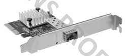
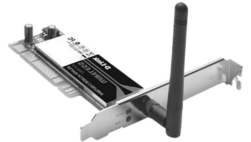
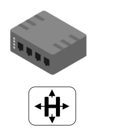
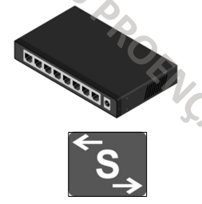
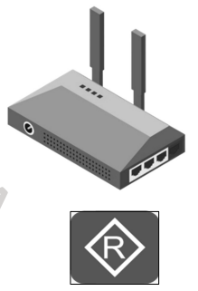
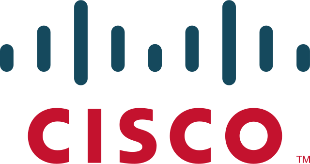
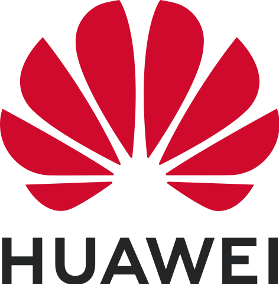
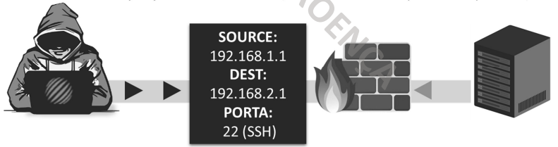
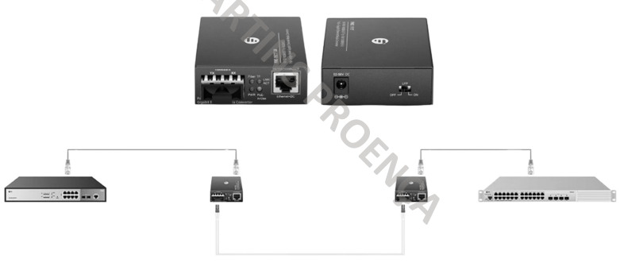

## Placas de Rede

### Bus + Ethernet

### Fibra Ótica

### Wireless

---
## Equipamentos de Rede

### HUB

- Opera na camada 1 do modelo OSI
- Não filtra tráfego
- Retransmite os dados para todas as port's
- Opera em half-duplex (HDX)
- Pode gerar colisões e delays na rede
- Hubs passivos: não amplificam o sinal
- Hubs ativos: amplificam o sinal a retransmitir
- Simples de configurar e baixo custo

### SWITCH

###### SWITCH LAYER 2
- Opera na camada 2 do modelo OSI
- Filtra tráfego
- Operam em half-duplex (HDX) e full-duplex (FDX)
- Enviam apenas para o destinatário 
- Separam domínios de colisões 
- Acesso de dispositivos de utilizadores finais
- Funções básicas de segurança
- Não fazem roteamento de VLAN's

###### SWITCH LAYER 3
- Na maioria das vezes usados como Core Switch
- Opera na camada 2 e na camada 3 do modelo OSI
- Faz roteamento de VLAN's
- Capacidades de roteamento
- Menos features de roteamento que um router

### ROUTER

- Opera na camada 3 do modelo OSI
- Comunicação entre redes
- Isolamento de domínios de Broadcast
- Manutenção da tabela de roteamento
- Execução de protocolos de roteamento
- Seleção de rotas e encaminhamento de pacotes
- Implementação de acesso WAN
- Tradução de endereços de rede (NAT)

---
## Principais fabricantes de equipamentos de rede

###### CISCO

###### Juniper Networks

###### HUAWEI

###### MikroTik

###### NOKIA

---
## Dispositivos Wireless

### ACCESS CONTROLLER (AC)                                                 ACCESS POINT (AP)

---
### Wireless AP - Modo Local

### Wireless AP - Modo Bridge

---
## Firewalls

- Hardwares/Softwares concebidos para prevenir acesso não autorizado
- Regras baseadas no IP de destino ou origem de uma determinada rede
- Também analisar o número das port's utilizadas e padrões de tráfego 
- Instalado na junção de duas redes (usualmente rede privada e pública)

### Firewalls (IDS + IPS)

### Fabricantes de Firewalls

---
## Conversores

