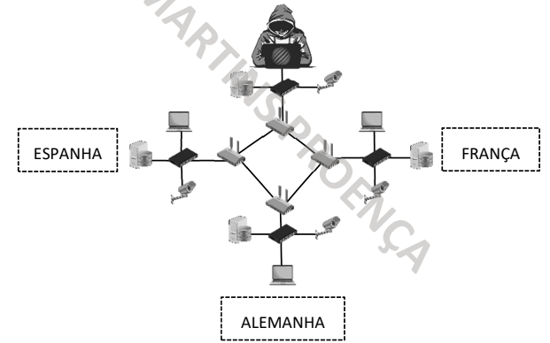

---
## PAN - Personal Area Network

---

## LAN - Local Area Network

---

## MAN - Metropolitan Area Network

---

## WAN - Wide Area Network

---

### Others

___WLAN - Wireless LAN___
___VLAN - Virtual LAN___
___VPN - Virtual Private Network___
