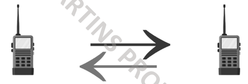

## Simplex

- Comunicação só acontece numa direção entre dispositivos 
- Apenas o remetente pode enviar informações
- Exemplos: Teclado, Monitor...

---
## Half-Duplex

- Comunicação só acontece numa direção de cada vez
- Pode enviar e receber informações mas separadamente
- Exemplos: Walkie-Talkie, Hub...

---
## Full-Duplex

- Comunicação pode acontecer em ambas as direções em simultâneo
- Ambos podem enviar e receber informações
- Exemplos: Telefone, Full-Duplex Ethernet
