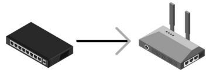
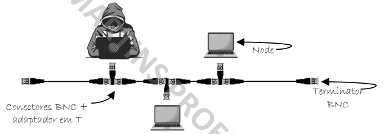
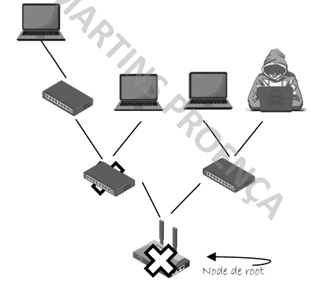
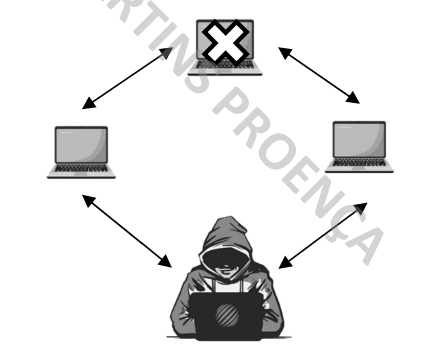
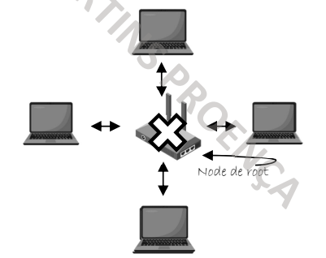

## Point-to-Point

---
## Point-to-MultiPoint

---
## Barramento (BUS)

- Todos os nodes estão interligados pelo cabo de backbone
- Só uma comunicação em simultâneo. Se falhar os outros não são afetados
- Pouca escalabilidade, sendo apenas adequada a pequenas redes
- Pouca segurança e performance, e difícil de fazer troubleshooting

---
## Árvore (TREE)

---
## Anel (RING)

---
## Estrela (STAR)

---
#