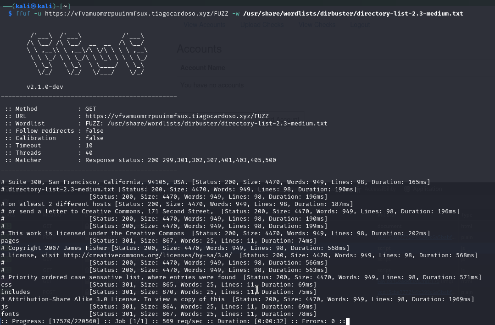
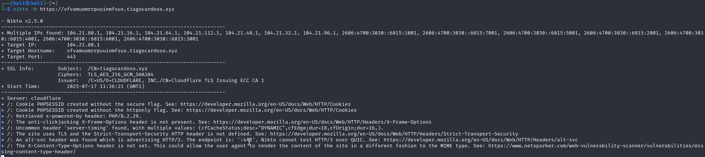

Login:

 Fatal error: Uncaught mysqli_sql_exception: Field 'balance' doesn't have a default value in /var/www/html/includes/account-page.php:28 Stack trace: #0 /var/www/html/includes/account-page.php(28): mysqli->query('INSERT INTO acc...') #1 /var/www/html/account.php(8): include('/var/www/html/i...') #2 {main} thrown in /var/www/html/includes/account-page.php on line 28

## file injection
webshell with php file

## http work's

Sql Injection - Critical 9.6 
Remote File Upload With comand injection - Critical 9.6 
Database Dump Acessible with User Credentials & Weak hashes - High 8.0 
Missing redirect from Http to Https - High 7.5 
IDOR on /Checks - High 7.4 
No Limit on Login attempts - High 7.3 
Cockies missing secure/httponly7same site - Medium 6.8 
reflected XSS - Medium 6.0 
Ability to create blank or "admin" accounts - Medium 5.8 
Missing HTTP headers - Low 3.5